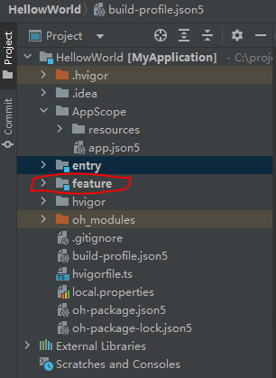
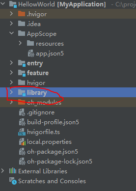

# 应用程序包开发与使用

## HAP

[HAP](https://developer.huawei.com/consumer/cn/doc/harmonyos-guides-V5/hap-package-V5)（Harmony Ability Package）是应用安装和运行的基本单元。HAP包是由代码、资源、第三方库、配置文件等打包生成的模块包，其主要分为两种类型：entry和feature。

- entry：应用的主模块，作为应用的入口，提供了应用的基础功能。
- feature：应用的动态特性模块，作为应用能力的扩展，可以根据用户的需求和设备类型进行选择性安装。

应用程序包可以只包含一个基础的entry包，也可以包含一个基础的entry包和多个功能性的feature包。

### 使用场景

- 单HAP场景：如果只包含UIAbility组件，无需使用ExtensionAbility组件，优先采用单HAP（即一个entry包）来实现应用开发。虽然一个HAP中可以包含一个或多个UIAbility组件，为了避免不必要的资源加载，推荐采用“一个UIAbility+多个页面”的方式。
- 多HAP场景：如果应用的功能比较复杂，需要使用ExtensionAbility组件，可以采用多HAP（即一个entry包+多个feature包）来实现应用开发，每个HAP中包含一个UIAbility组件或者一个ExtensionAbility组件。在这种场景下，可能会存在多个HAP引用相同的库文件，导致重复打包的问题。

### 约束限制

[详情](https://developer.huawei.com/consumer/cn/doc/harmonyos-guides-V5/hap-package-V5#约束限制)

### 创建

下面简要介绍如何通过DevEco Studio新建一个HAP模块。

1. 创建工程，构建第一个ArkTS应用。
2. 在工程目录上单击右键，选择**New > Module**。
3. 在弹出的对话框中选择**Empty Ability**模板，单击**Next**。
4. 在Module配置界面，配置**Module name**，选择**Module Type**和**Device Type**，然后单击**Next**。
5. 在Ability配置界面，配置**Ability name**，然后单击**Finish**完成创建。

在构建ArkTS引用后可新建**Feature**类型的**HAP**，建成之后的目录如下：



### 编译

编译之后可生成对应**Module**的目录，具体如下：

**entry**：entry/build/*

**feature**：feature/build/*

## HAR

[HAR](https://developer.huawei.com/consumer/cn/doc/harmonyos-guides-V5/har-package-V5)（Harmony Archive）是静态共享包，可以包含代码、C++库、资源和配置文件。通过HAR可以实现多个模块或多个工程共享ArkUI组件、资源等相关代码。

### 使用场景

- 作为二方库，发布到[OHPM](https://ohpm.openharmony.cn/)私仓，供公司内部其他应用使用。
- 作为三方库，发布到[OHPM](https://ohpm.openharmony.cn/)中心仓，供其他应用使用。

### 约束限制

[详情](https://developer.huawei.com/consumer/cn/doc/harmonyos-guides-V5/har-package-V5#约束限制)

### 创建

通过开发工具创建一个名为library的HAR模块

1. 鼠标移到工程目录顶部，单击右键，选择**New > Module**，在工程中添加模块。
2. 在**Choose Your Ability Template**界面中，选择**Static Library**，并单击**Next**。

生成的目录如下：



### 编译

编译之后可生成对应**Module**的目录，具体如下：

**library**：library/build/*

### 开发

导出**HAR**的ArkUI组件、接口、资源，可以供其他应用或当前应用的其他模块引用。

Index.ets文件是HAR导出声明文件的入口，HAR需要导出的接口，统一在Index.ets文件中导出。Index.ets文件是DevEco Studio默认自动生成的，用户也可以自定义，在模块的oh-package.json5文件中的main字段配置入口声明文件，配置如下所示：

```json
{
  "main": "Index.ets"
}
```

#### 导出

##### 导出组件

组件

```ts
//library/src/main/ets/components/MainPage.ets
@Component
export struct MainPage {
  @State message: string = 'Hello World';

  build() {
    Row() {
      Column() {
        Text(this.message)
          .fontSize(50)
          .fontWeight(FontWeight.Bold)
      }
      .width('100%')
    }
    .height('100%')
  }
}
```

将组件导出

```ts
// library/index.ets
export { MainPage } from './src/main/ets/components/MainPage'
```

[其他导出](https://developer.huawei.com/consumer/cn/doc/harmonyos-guides-V5/har-package-V5#导出ts类和方法)

#### 使用

其他**Module**可以引用**HAR**的ArkUI组件、接口、资源。

##### [引用共享包](https://developer.huawei.com/consumer/cn/doc/harmonyos-guides-V5/ide-har-import-V5)

引用三方HAR，包括从仓库进行安装、从本地文件夹和本地压缩包中进行安装三种方式。

- 引用ohpm仓中的HAR

```
方式一
切换到对应模块，如entry
cd path/to/your/project/entry
安装
ohpm install @ohos/lottie

方式二
在oh-package.json5中
"dependencies": {
  "@ohos/lottie": "^2.0.0"
}
安装
ohpm install
```

- 引用本地模块源码

```
方式一
切换到对应模块，如entry
cd path/to/your/project/entry
安装
ohpm install path/to/foo

方式二
在oh-package.json5中
"dependencies": {
  "folder": "file:path/to/foo" // 此处也可以是以当前oh-package.json5所在目录为起点的相对路径
}
安装
ohpm install
```

如本地新建的**library**可以这样安装：

1. 先进入entry,  cd entry 
2. 安装 ohpm install ../library

- 引用本地HAR/HSP包，有如下两种方式

**方式一**

引用HAR：

```bash
cd path/to/your/project/entry
ohpm install path/to/package.har
```

引用HSP（*.tgz包通过HSP模块在release模式下[编译](https://developer.huawei.com/consumer/cn/doc/harmonyos-guides-V5/ide-hsp-V5#section67683213597)生成）：

```bash
cd path/to/your/project/entry
ohpm install path/to/package.tgz
```

**方式二**

引用HAR：

```json
"dependencies": {
  "package": "file:path/to/package.har" // 此处也可以是以当前oh-package.json5所在目录为起点的相对路径。 
}                                      
```

引用HSP：

```json
"dependencies": {
  "package": "file:path/to/package.tgz" // 此处也可以是以当前oh-package.json5所在目录为起点的相对路径
}
```

最后ohpm install安装

另外，在安装或卸载共享包时，可在模块或工程的oh-package.json5文件中增加钩子设置，以管理install、uninstall命令的生命周期，配置示例如下：

```json
"hooks": {
   "preInstall": "echo 00 preInstall", // install命令执行之前
   "postInstall": "echo 00 postInstall", // install命令执行之后
   "preUninstall": "echo 00 preUninstall", // uninstall命令执行之前
   "postUninstall": "echo 00 postUninstall"  // uninstall命令执行之后
 }
```

##### 导入使用

```ts
import { MainPage } from 'library';//对应上面导出的模块
@Entry
@Component
struct Library {
  build() {
    Column() {
      MainPage()
    }
    .width('100%')
    .height('100%')
  }
}
```

##### [其他](https://developer.huawei.com/consumer/cn/doc/harmonyos-guides-V5/har-package-V5#引用har的ts类和方法)

## HSP

[HSP](https://developer.huawei.com/consumer/cn/doc/harmonyos-guides-V5/in-app-hsp-V5#%E4%BD%BF%E7%94%A8)（Harmony Shared Package）是动态共享包，可以包含代码、C++库、资源和配置文件，通过HSP可以实现代码和资源的共享。HSP不支持独立发布，而是跟随其宿主应用的APP包一起发布，与宿主应用同进程，具有相同的包名和生命周期。

### 使用场景

- 多个HAP/HSP共用的代码和资源放在同一个HSP中，可以提高代码、资源的可重用性和可维护性，同时编译打包时也只保留一份HSP代码和资源，能够有效控制应用包大小。
- HSP在运行时按需加载，有助于提升应用性能。
- 同一个组织内部的多个应用之间，可以使用集成态HSP实现代码和资源的共享。

### 约束限制

[详情](https://developer.huawei.com/consumer/cn/doc/harmonyos-guides-V5/in-app-hsp-V5#约束限制)

### 创建

通过开发工具创建一个名为library2的HSP模块。

1. 鼠标移到工程目录顶部，单击右键，选择**New > Module**，在工程中添加模块。
2. 在**Choose Your Ability Template**界面中，选择**Shared Library**，并单击**Next**。

```
MyApplication
├── library
│   ├── src
│   │   └── main
│   │       ├── ets
│   │       │   └── pages
│   │       │       └── index.ets
│   │       ├── resources
│   │       └── module.json5
│   ├── oh-package.json5
│   ├── index.ets
│   └── build-profile.json5 //模块级
└── build-profile.json5     //工程级
```

### 开发

导出HSP的ArkUI组件、接口、资源，可供应用内的其他HAP/HSP引用。

#### 导出

##### 导出组件

组件页面

```ts
// library2/src/main/ets/components/MyTitleBar.ets
@Component
export struct MyTitleBar {
  build() {
    Row() {
      Text($r('app.string.library_title'))
        .id('library')
        .fontFamily('HarmonyHeiTi')
        .fontWeight(FontWeight.Bold)
        .fontSize(32)
        .fontColor($r('app.color.text_color'))
    }
    .width('100%')
  }
}
```

对外暴露的接口，需要在入口文件index.ets中声明：

```typescript
// library2/index.ets
export { MyTitleBar } from './src/main/ets/components/MyTitleBar';
```

##### 导出资源文件

将需要对外提供的资源封装为一个资源管理类：

```ts
// library2/src/main/ets/ResManager.ets
export class ResManager{
  static getPic(): Resource{
    return $r('app.media.pic');
  }
  static getDesc(): Resource{
    return $r('app.string.shared_desc');
  }
}
```

对外暴露的接口，需要在入口文件index.ets中声明：

```ts
// library2/index.ets
export { ResManager } from './src/main/ets/ResManager';
```

[其他导出](https://developer.huawei.com/consumer/cn/doc/harmonyos-guides-V5/in-app-hsp-V5#导出ts类和方法)

#### 使用

和HAR类型，具体参考[官网](https://developer.huawei.com/consumer/cn/doc/harmonyos-guides-V5/ide-har-import-V5)

```ts
import { ResManager, MyTitleBar } from 'library2';
@Entry
@Component
struct Library2 {
  build() {
    Column() {
      MyTitleBar()
      Image(ResManager.getPic())
        .width(50)
        .height(50)
      Text(ResManager.getDesc())
    }
    .width('100%')
    .height('100%')
  }
}
```

##### [其他](https://developer.huawei.com/consumer/cn/doc/harmonyos-guides-V5/in-app-hsp-V5#页面路由跳转)

## [动态import](https://developer.huawei.com/consumer/cn/doc/harmonyos-guides-V5/arkts-dynamic-import-V5)

## [延迟加载（lazy import）](https://developer.huawei.com/consumer/cn/doc/harmonyos-guides-V5/arkts-lazy-import-V5)