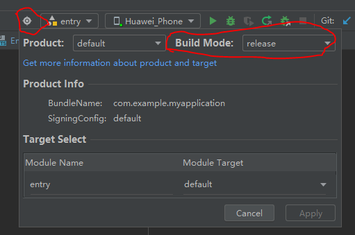

## HarmonyOS NEXT 学习记录

### 环境配置

[官网例子](https://developer.huawei.com/consumer/cn/doc/harmonyos-guides-V5/ide-customized-multi-targets-and-products-guides-0000001731595144-V5#section18668905913)

1. 在项目根目录的工程级**build-profile.json5**里加入以下配置：

- **products**：产品品类，可配置多个，可针对不同环境，如国内版，国际版等，**default**必须存在。
- **buildModeSet**：构建模式合集，默认为**debug**和**release**。
- **modules**：工程中所包含模块的信息，包含工程中所有的模块。
- **targets**：模块的target信息，用于定制多目标构建产物。

在这里主要对**targets**信息进行修改，**default**可以为本地环境，**custom**为正式环境。

```json
{
  "app": {
    "signingConfigs": [],
    "products": [
      {
        "name": "default",
        "signingConfig": "default",
        "compatibleSdkVersion": "5.0.0(12)",
        "runtimeOS": "HarmonyOS",
      },
    ],
    "buildModeSet": [
      {
        "name": "debug",
      },
      {
        "name": "release"
      }
    ]
  },
  "modules": [
    {
      "name": "entry",
      "srcPath": "./entry",
      "targets": [
        {
          "name": "default",
          "applyToProducts": [
            "default"
          ]
        },
        {
          "name": "custom",
          "applyToProducts": [
            "default"
          ]
        }
      ]
    }
  ]
}
```

2. 在**entry**里的模块级**build-profile.json5**里加入以下配置：

这里主要是对应项目级**build-profile.json5**的**targets**，名称对应，然后再添加**sourceRoots**作为差异性代码的区分，新增文件夹要与**main**文件同级。

```json
{
  "targets": [
    {
      "name": "default",
      "source": {
        "sourceRoots": [
          "./src/default"
        ]
      }
    },
    {
      "name": "custom",
      "source": {
        "sourceRoots": [
          "./src/custom"
        ]
      }
    }
  ]
}
```

3. 然后就可以在对应文件夹下新建文件，写入差异性代码，最后通过以下方式引入并使用：

```ts
/** 配置 **/
// entry/src/default/config.ets
export const ENV = 'dev';
export const BASE_URL = 'http://southsmart.com/wushui/sgeocserver';
// entry/src/custom/config.ets
export const ENV = 'prd';
export const BASE_URL = 'http://southsmart.com/wushui/sgeocserver-prd';

/** 使用 **/
// entry/src/main/ets/pages/index.ets
import { ENV } from 'entry/config';
```

在开发工具上可以自由选择对应环境：


### 构建

#### HAP

**HAP**（Harmony Ability Package）是应用安装和运行的基本单元。HAP包是由代码、资源、第三方库、配置文件等打包生成的模块包，其主要分为两种类型：**entry**和**feature**。

- **entry**：应用的主模块，作为应用的入口，提供了应用的基础功能。
- **feature**：应用的动态特性模块，作为应用能力的扩展，可以根据用户的需求和设备类型进行选择性安装。

应用程序包可以只包含一个基础的**entry**包，也可以包含一个基础的**entry**包和多个功能性的**feature**包。

##### 开始构建

[官网例子](https://developer.huawei.com/consumer/cn/doc/harmonyos-guides-V5/ide-hvigor-build-har-0000001772704332-V5)

1. 构建前可以选择**debug**和**release**两种默认提供的构建模式，同时支持开发者自定义构建模式。

- **debug**构建模式时，默认产物是包含源码的构建，用于开发者进行本地调测；同时支持配置产物格式为字节码**HAR**，用于提升编译构建效率。
- **release**构建模式时，从DevEco Studio NEXT Developer Beta3（5.0.3.600）版本开始，默认不开启混淆，构建产物和**debug**模式相同；开启混淆后，构建产物是包含js中间码的HAR，用于发布到ohpm中心仓；同时支持配置产物格式为字节码HAR，用于提升发布产物的安全性。



2. 选中**HAR**模块的根目录，点击**Build > Make Module '<module-name>'**启动构建


3. 构建完成后在以下目录**\entry\build\default\outputs**可以找到**HAR**产物

### 界面

[**ArkUI**](https://developer.huawei.com/consumer/cn/doc/harmonyos-guides-V5/arkui-V5)（方舟UI框架）为应用的UI开发提供了完整的基础设施，包括简洁的UI语法、丰富的UI功能（组件、布局、动画以及交互事件），以及实时界面预览工具等，可以支持开发者进行可视化界面开发。

#### 基本概念

- **UI：** 即用户界面。开发者可以将应用的用户界面设计为多个功能页面，每个页面进行单独的文件管理，并通过[页面路由](https://developer.huawei.com/consumer/cn/doc/harmonyos-guides-V5/arkts-routing-V5)API完成页面间的调度管理如跳转、回退等操作，以实现应用内的功能解耦。
- **组件：** UI构建与显示的最小单位，如列表、网格、按钮、单选框、进度条、文本等。开发者通过多种组件的组合，构建出满足自身应用诉求的完整界面。

#### 使用

- ui界面在**build**生命周期中编写
- 组件样式重用[**@Styles**](https://developer.huawei.com/consumer/cn/doc/harmonyos-guides-V5/arkts-style-V5)
- 多态样式[**stateStyles**](https://developer.huawei.com/consumer/cn/doc/harmonyos-guides-V5/arkts-statestyles-V5)
- 扩展组件样式[**@Extend**](https://developer.huawei.com/consumer/cn/doc/harmonyos-guides-V5/arkts-extend-V5)
- 自定义构建函数[**@Builder**](https://developer.huawei.com/consumer/cn/doc/harmonyos-guides-V5/arkts-builder-V5)
- 维持父子组件关系[**@LocalBuilder**](https://developer.huawei.com/consumer/cn/doc/harmonyos-guides-V5/arkts-localbuilder-V5)
- 引用@Builder函数[**@BuilderParam**](https://developer.huawei.com/consumer/cn/doc/harmonyos-guides-V5/arkts-builderparam-V5)
- 封装全局[**@BuilderwrapBuilder**](https://developer.huawei.com/consumer/cn/doc/harmonyos-guides-V5/arkts-wrapbuilder-V5)
- 定义可动画属性[**@AnimatableExtend**](https://developer.huawei.com/consumer/cn/doc/harmonyos-guides-V5/arkts-animatable-extend-V5)
- 校验构造传参[**@Require**](https://developer.huawei.com/consumer/cn/doc/harmonyos-guides-V5/arkts-require-V5)

以下是一个登录页面ui的示例：

```ts
import { encryption } from 'utils/encryption';
import { promptAction, router, font } from '@kit.ArkUI';
import request from "request";
import PageLoading from 'ets/components/PageLoading';
import { BusinessError } from '@kit.BasicServicesKit';
import { preferences } from '@kit.ArkData';
const options: preferences.Options = { name: 'myStore' };
const dataPreferences: preferences.Preferences = preferences.getPreferencesSync(getContext(), options);

// 顶部标题样式
@Extend(Text) function topTitle() {
  .fontSize(28)
  .fontColor('#141719')
  .fontFamily('DingTalk JinBuTi')
}
// 输入框标题样式
@Extend(Text) function inputTitle() {
  .fontSize(14)
  .fontColor('#44494C')
  .margin({
    bottom: 8
  })
}
// 输入框样式
@Extend(TextInput) function input() {
  .backgroundColor('#FFFFFF')
  .padding(0)
  .fontSize(14)
  .fontColor('#44494C')
  .placeholderColor('#ABAEB2')
  .placeholderFont({
    size: 14
  })
}
// 输入框父元素样式
@Extend(Flex) function inputWrap() {
  .width('100%')
  .height(44)
  .border({
    width: 1,
    color: '#E4EAF6',
    radius: 4
  })
  .padding({
    left: 10
  })
}


@Entry
@Component
struct Login {
  @State username: string = '' // 用户名
  @State password: string = '' // 密码
  @State ver_code: string = '' // 验证码
  @State ver_image: string = '' // 验证码图片
  @State ver_key: string = '' // 验证码key
  @State protocolChecked: boolean = false // 协议查看
  @State isLoading: boolean = false // 是否加载中

  aboutToAppear() {
    font.registerFont({
      familyName: 'DingTalk JinBuTi',
      familySrc: $rawfile('font/DingTalk JinBuTi.ttf')
    })
    this.getCode();
  }

  // 是否展示组件
  @Builder handlePageLoading() {
    if (this.isLoading) PageLoading();
  }

  // 获取验证码
  async getCode() {
    interface R {
      ver_image: string,
      ver_key: string
    }
    let req = await request<R>('getVerCode');
    let err = req.err;
    let res = req.res as R;
    if (err) return
    console.info('getVerCode', res);
    this.ver_image = res.ver_image;
    this.ver_key = res.ver_key;
  }
  // 登录
  async login() {
    if (!this.protocolChecked) {
      promptAction.showToast({
        message: '请先勾选协议！'
      })
      return
    }
    this.isLoading = true;
    interface R {
      access_token: string
    }
    interface Q {
      username: string
      password: string
      ver_key: string
      grant_type: string
      ver_code: string
    }
    let query: Q = {
      username: this.username,
      password: encryption(this.password, '-----BEGIN PUBLIC KEY-----MIGfMA0GCSqGSIb3DQEBAQUAA4GNADCBiQKBgQDKRXq3p8VoLB4P5H3aeIbwABaXJNDDfAXX/ePpY/kXCnIQbZOaxgxVOP2bYnldDxgQ3j9OiUq2celccy4ohROcGA7JCmkDqKCcLHyRlxYScbFOhO5EDac/DsRytebt03R/H1wSfVloIbIMIjN2tN+58RxUxLUhITyPGwLngPjf+wIDAQAB-----END PUBLIC KEY-----'),
      ver_key: this.ver_key,
      grant_type: 'password',
      ver_code: this.ver_code
    }
    let req = await request<R, Q>('login', query);
    this.isLoading = false;
    let err = req.err;
    if (err) return
    let res = req.res as R;
    let token = 'Bearer ' + res.access_token;

    dataPreferences?.putSync('token', token);

    promptAction.showToast({
      message: '登录成功',
      duration: 1500
    })
    setTimeout(() => {
      router.pushUrl({ url: 'pages/Home' }).then(() => {
        console.info('跳转首页')
      }).catch((err: BusinessError) => {
        console.error('跳转失败:', err)
      })
    }, 1500)
  }
  build() {
    Flex({
      direction: FlexDirection.Column
    }) {
      Stack() {
        Image($r('app.media.ic_login_bg'))
          .width('100%')
          .height('100%')
          .objectFit(ImageFit.Cover)
        Flex({
          direction: FlexDirection.Column,
          alignItems: ItemAlign.Start
        }) {
          Text('欢迎登录')
            .topTitle()
          Text('智清智慧巡检')
            .topTitle()
          Row()
            .width(32)
            .height(4)
            .backgroundColor('#408CFF')
            .borderRadius(20)
            .margin({
              top: 22
            })
        }
        .width('100%')
        .margin({
          top: 80
        })
        .padding({
          left: 45
        })
      }
      .width('100%')
      .height(237)
      Column() {
        Column() {
          Text('用户名')
            .inputTitle()
          Flex({
            alignItems: ItemAlign.Center
          }) {
            TextInput({
              placeholder: '请输入用户名',
              text: this.username
            })
              .input()
              .onChange((value: string) => {
                this.username = value;
              })
            Image($r('app.media.ic_close'))
              .width(20)
              .height(20)
              .onClick(() => {
                this.username = '';
                console.info('this.username', this.username)
              })
          }
          .inputWrap()
          .padding({
            left: 10,
            right: 20
          })
        }
        .alignItems(HorizontalAlign.Start)
        .margin({
          bottom: 8
        })
        Column() {
          Text('密码')
            .inputTitle()
          Flex({
            alignItems: ItemAlign.Center
          }) {
            TextInput({
              placeholder: '请输入密码',
              text: this.password
            })
              .input()
              .type(InputType.Password)
              .passwordIcon({
                onIconSrc: $r('app.media.ic_close_eye'),
                offIconSrc: $r('app.media.ic_open_eye')
              })
              .onChange((value: string) => {
                this.password = value;
              })
          }
          .inputWrap()
        }
        .alignItems(HorizontalAlign.Start)
        .margin({
          bottom: 8
        })

        Column() {
          Text('验证码')
            .inputTitle()
          Flex({
            alignItems: ItemAlign.Center,
            justifyContent: FlexAlign.SpaceBetween
          }) {
            Flex({
              alignItems: ItemAlign.Center
            }) {
              TextInput({
                placeholder: '请输入验证码',
                text: this.ver_code
              })
                .input()
                .onChange((value: string) => {
                  this.ver_code = value;
                })
            }
            .inputWrap()
            .width(150)
            Image(this.ver_image)
              .width(100)
              .height(44)
              .objectFit(ImageFit.Contain)
              .onClick(() => {
                this.getCode()
              })
          }
        }
        .alignItems(HorizontalAlign.Start)
        .margin({
          bottom: 8
        })
        Button('登录', {
          type: ButtonType.Normal
        })
          .width('100%')
          .height(42)
          .margin({
            top: 32
          })
          .fontColor('#fff')
          .fontWeight(FontWeight.Bold)
          .fontSize(16)
          .backgroundColor('#408CFF')
          .borderRadius(30)
          .onClick(() => {
            this.login();
          })
      }
      .padding({
        top: 8,
        left: 45,
        right: 45
      })
      Column() {
        Column() {
          Text($r('app.string.company_zh_name'))
            .fontColor('#BDD7FF')
            .fontSize(14)
          Text($r('app.string.company_en_name'))
            .fontColor('#BDD7FF')
            .fontSize(8)
        }
        .width('100%')
        .position({
          top: 70
        })
        Flex({
          alignItems: ItemAlign.Center,
          justifyContent: FlexAlign.Center
        }) {
          Image(this.protocolChecked ? $r('app.media.ic_done_b') : $r('app.media.ic_unCheck'))
            .width(12)
            .height(12)
            .margin({
              right: 5
            })
          Text('登录即代表同意')
            .fontSize(12)
            .fontColor('#868A8F')
          Text('《用户协议》')
            .fontSize(12)
            .fontColor('#5297FE')
          Text('《隐私协议》')
            .fontSize(12)
            .fontColor('#5297FE')
        }
        .width('100%')
        .position({
          bottom: 10
        })
        .onClick(() => {
          this.protocolChecked = !this.protocolChecked;
        })
      }
      .height(0)
      .flexGrow(1)
      this.handlePageLoading()
    }
    .width('100%')
    .height('100%')
  }
}
```

### 状态管理

我们构建的页面多为静态界面。如果希望构建一个动态的、有交互的界面，就需要引入“状态”的概念。

#### 管理组件拥有的状态

- **[@State装饰器：组件内状态](https://developer.huawei.com/consumer/cn/doc/harmonyos-guides-V5/arkts-state-V5)**
- **[@Prop装饰器：父子单向同步](https://developer.huawei.com/consumer/cn/doc/harmonyos-guides-V5/arkts-prop-V5)**
- **[@Link装饰器：父子双向同步](https://developer.huawei.com/consumer/cn/doc/harmonyos-guides-V5/arkts-link-V5)**
- **[@Provide装饰器和@Consume装饰器：与后代组件双向同步](https://developer.huawei.com/consumer/cn/doc/harmonyos-guides-V5/arkts-provide-and-consume-V5)**
- **[@Observed装饰器和@ObjectLink装饰器：嵌套类对象属性变化](https://developer.huawei.com/consumer/cn/doc/harmonyos-guides-V5/arkts-observed-and-objectlink-V5)**

#### 管理应用拥有的状态

......

#### 其他状态管理

......

